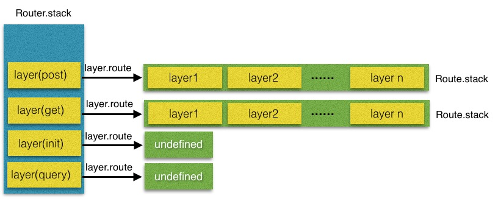
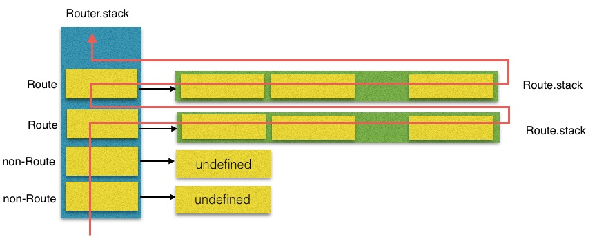
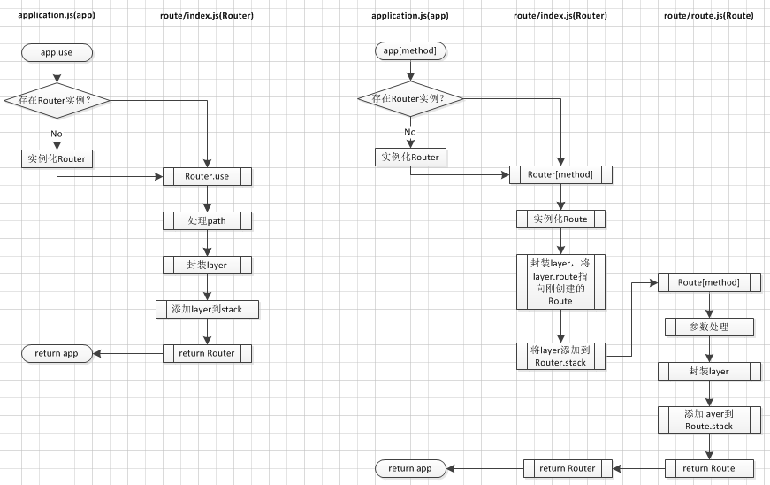

# express 

> 手动实现一个 express 框架，基于 TDD 模式开发，用于加深理解。复习时根据 git log 递进式阅读。

## 项目目录

```
├── LICENSE
├── README.md
├── lib                     框架源码
│   ├── application.js      app 应用构造函数
│   ├── express.js          主入口
│   └── router              
│       ├── index.js        router 路由器构造函数
│       ├── layer.js        layer 层构造函数
│       └── route.js        route 路由构造函数
├── package-lock.json
├── package.json
└── test                    测试用例
    ├── 1.base.js           基本功能
    ├── 2.router.js         路由系统
    ├── 3.middleware.js     中间件
    └── 4.params.js         路径参数
```

## 一、构建基本服务器

### 1.1 基本功能

1. express 模块导出一个函数，执行后返回一个 app 对象
2. app.get 方法用于添加一条路由规则到内部缓存
3. app.listen 方法用于启动一个 HTTP 服务器并指定处理函数

### 1.2 测试用例

```javascript
const express = require('express');
const app = express();

app.get('/', (req, res) => {
    res.end('hello express');
});

app.listen(8080);
```

### 1.3 代码实现思路

1. 创建 `createApplication` 方法并导出，该方法返回 app 对象，有两个方法 get 和 listen
2. `app.get` 方法缓存路由规则，设定一个缓存队列 router 数组，并默认存入一条通用匹配规则
3. `app.listen` 方法创建服务器，用于遍历路由规则并执行对应回调，监听服务时将 listen 实参直接传给 http.Server 实例的 listen 方法

## 二、封装 Router

### 2.1 基本功能

1. app 从字面量变为 Application 类
2. 封装 Router
    - 路径一样的路由整合为一组，引入 Layer 的概念
    - 增加路由控制，支持 next 方法，并增加错误捕获功能
    - 执行 Router.handle 的时候传入 out 参数，注意两层 layer 中不同
    - 丰富 HTTP 请求方法

### 2.2 测试用例

```javascript
const express = require('express');
const app = express();

app.get('/', (req, res, next) => {
    console.log(1.1);
    // next(); 
    next('wrong'); 
}, (req, res, next) => {
    console.log(1.2);
    next();
}).get('/', (req, res, next) => {
    console.log(2.1);
    next();
}).get('/', (req, res, next) => {
    console.log(3.1);
    res.end('ok');
});
app.listen(8080);
```

### 2.3 代码实现思路

> 整个路由的请求处理过程类似于`二维数组`的深度优先遍历

路由层级描述：
```
├── Router 路由系统
│   └── router.stack 数组
│       └── layer 层 <- path + route.dispath ，path 区分
│           └── route 路由 <- path
│               └── route.stack 数组
│                   └──  layer 层 <- path '/' + handler ，method 分别
```

1. 将 app 从字面量变为 Application 类
    - createApplicaton 方法执行返回一个 Application 的实例
    - 将 get 和 listen 方法改为 Application 类的原型方法
    - 此时将 router 和应用分离开，也采用构建实例的方式，且 app.get 和 app.listen 配置路由和处理路由都将由 Router 类的实例去处理
2. **封装 Router**（按照上面的层级描述）
    1. 处理 app.get 配置路由
        - `Router.prototype.route` 创建第一层 `layer` ，用 `path` 作为第一层遍历的标识，存储的是 `route.dispatch`
        - `Route.prototype.get` 配置第二层 `layer` ，用 `method` 作为第二层遍历的标识，存储的是用户传入的 `handler`
    2. 处理 app.listen 处理请求
        - `Router.prototype.handler` 第一层遍历方法
            - 用 path 遍历第一层 layer ，匹配到就调用 `route.dispatch` 进入第二层遍历
            - 遍历不到就继续向下 next ，遍历下一个第一层级 layer (其中每个元素存储的是一个路由)
            - 触达边界时，调用 out 方法( app.listen 传入的 `done` 方法)结束整个遍历
        - `Route.prototype.dispatch` 第二层遍历方法
            - 用 method 遍历第二层 layer ，匹配到就执行用户传入的 `handler` 方法，并将第二层的 next 传出，交由用户控制向下执行
            - 遍历不到就继续向下 next ，遍历下一个第二层级 layer (其中每个元素存储的是一个 handler)
            - 触达边界时，调用 out 方法( Router.prototype.handler 传入的 `next` 方法)结束当前第二层 layer 遍历，回到第一层的遍历
3. 完善 Router
    - 丰富 HTTP 请求方法
        - 使用第三方包 methods ，等同于 http.METHODS ，但元素均小写
    - 增加多 handler 功能
        - 不定参处理，apply、slice
    - 增加链式调用功能
        - Application.prototype[method] 返回 this
    - 增加错误捕获功能
        - next 传参时，会跳过后续处理函数，直接到错误中间件处理
        - 前面提到了，用户的 handler 是在 route.dispatch 方法中调用的，handler 中的 next 方法也是 dispatch 中定义，所以要先在这里跳出

## 三、实现中间件

### 3.1 基本功能

- application.use 方法添加中间件
- 二级路由实现
    - 修改 Router 类为普通函数，返回 router 函数，用于支持中间件定义二级路由
    - router 处理中间件

### 3.2 测试用例

```javascript
const express = require('express');
// const express = require('../lib/express');
const app = express();

app.use((req, res, next) => {
    console.log('Ware1:', Date.now());
    next();
    // next('wrong');
});
app.get('/', (req, res, next) => {
    res.end('1');
});

// 声明二级路由系统，也拥有各种请求方法，而且还有 use 方法添加私有中间件
const user = express.Router();
user.use((req, res, next) => {
    console.log('Ware2', Date.now());
    next();
});
user.use('/2', (req, res, next) => {
    res.end('2');
});
// 使用二级路由
app.use('/user', user);

// 错误中间件
app.use((err, req, res, next) => {
    res.end('catch ' + err);
});
app.listen(8080);
```

### 3.3 代码实现思路

1. 添加 express.Router ，用于创建二级路由实例
    - 测试用例中 app.use('/user', user); 此时 user 是个中间件的处理函数，格式必然是 function(req, res, next)
    - 所以 Router 类构造函数要`改成普通函数`，且返回一个函数用于满足上面要求
    - 为了使函数 router 依然拥有原来的几个原型方法，需要使用 `Object.setPrototypeOf` 设置原型对象
2. 添加 app.use 方法
    - 中间件和普通路由放在`同一个数组 _router.stack` 中，app.use 调用的应该是 router.use
3. 处理子路由，修改 router.handler 方法
    - 匹配路径成功后，需要区分中间件层和路由层做不同的处理，此时的区分标准就是是否存在 `layer.route` ，路由层的处理不变
    - 中间件层可以添加子路由，此时需要处理路径问题，当前次调用 layer.handle 方法前需要去除`前缀路径`，下次调用 next 时要将路径缓存，所以有一个 `removed` 变量存储前缀路径
4. 错误处理，错误中间件

### 3.4 路由、中间件的总结

> [从express源码中探析其路由机制](https://cnodejs.org/topic/545720506537f4d52c414d87)

直观层级展示：


执行顺序展示：


规则添加过程:


## 四、路径参数相关

### 4.1 基本功能

- req.params 获取路由中的路径参数
    - '/user/:id/:name' 和 '/user/1/moon' 匹配结果 { id: 1, name: moon }
- app.param 定义存在指定 param 的路径公共的处理操作
    - 在 Router.handle 中，process_params 函数一次调用参数处理函数

### 4.2 测试用例

```javascript
// const express = require('express');
const express = require('../lib/express');
const app = express();

app.param('uid', (req, res, next, val, name) => {
    req.user = {
        id: 1,
        name: 'moon'
    };
    next();
})
app.param('uid', (req, res, next, val, name) => {
    req.user.name = 'moon.wang';
    next();
})
app.get('/user/:uid', (req, res) => {
    console.log(req.user);  // 前面配置的
    console.log(req.params); // 路径参数
    res.end('user');
});

app.listen(8080);
```

### 4.3 代码实现思路

1. 将 path 编译成正则，并缓存 params 的键
    - 使用第三方包 path-to-regexp 提取 params
        - 原理：replace + 正则
            ```javascript
            let keys = [];
            function pathToRegexp(path, keys) {
                return path.replace(/:([^\/]+)/g, function () {
                    keys.push({
                        name: arguments[1],
                        optional: false,
                        offset: arguments[2]
                    });
                    return '(?:([^\/]+?))';
                });
            }
            let result = pathToRegexp(path, keys);
            // result: /^\/user\/(?:([^\/]+?))\/(?:([^\/]+?))\/?$/i
            ```
    - 这个操作应该用在哪？应该是在创建路由规则的时候处理，那么具体应该在哪一步？应该是`第一层 layer` 实例创建的时候，因为该 layer 就是用 path 来区分的
2. 处理路由请求时的路径匹配
    - 匹配时，需要用上一步生成的 regexp 来进行匹配判断
    - 匹配成功是，用匹配结果和上一步生成的 keys 联合生成 params 对象
    - 这个对象添加到 layer 实例上，在 router.handler 中将其赋给 req 对象，完成了 req.params 功能
3. 实现 app.param 功能
    1. 设置
        - app.param 方法只做了`参数透传`给 router.param
        - router.param 方法只做了回调方法缓存处理，用键值对的方式
    2. 调用
        - 执行时，缓存的回调方法应该在实际的路由处理函数之前调用
        - 调用过程其实就是遍历前面获取的 keys ，查看是否有对应的回调函数，有则执行，无则继续遍历直到完成后，跳回路由处理主流程

## 五、模板引擎

### 5.1 基本功能

- 开发或绑定渲染引擎
- 注册渲染引擎
- 配置渲染引擎，指定模版路径
- 渲染模版引擎

### 5.2 测试用例

```javascript
// const express = require('express');
const express = require('../lib/express');

const path = require('path');
const app = express();

// 设置模板引擎渲染方法
// app.engine('html', require('ejs').__express);
app.engine('html', require('../lib/html'));
// 设置模板存放根目录
app.set('views', path.resolve(__dirname, 'views'));
// 设置模板默认后缀名
app.set('view engine', 'html');

app.get('/', (req, res, next) => {
    res.render('index', {
        title: 'hello',
        user: {
            name: 'moon'
        }
    });
});

app.listen(8080);
```

### 5.3 代码实现思路

模板引擎原理：
```javascript
// 简单版，将占位 <%=name%> 替换成 data[name] 的值
function render(tmplStr, data) {
    return tmplStr.replace(/<%=(\w+?)%>/g, function () {
        // arguments[1] 即正则匹配到的 \w+? 内容，也就是占位的 key
        return data[arguments[1]];
    });
}

// 进阶版，添加函数头和尾，构成完整函数体执行，并返回结果
function render(tmplStr, data) {
    // with 语句，将参数对象添加到内部语句的作用域链顶部，可以减少变量的长度，如 data.a 直接写 a
    let head = "let tpl = ``;\nwith (data) {\n tpl+=`";

    // 先替换占位，<%=name%> 替换成 ${name} ，用于后面拼接模板字符串占位
    tmplStr = tmplStr.replace(/<%=([\s\S]+?)%>/g, function () {
        // 使用 arguments 时不要用箭头函数
        return "${" + arguments[1] + "}";
    });
    // 剩余 <%if%> 之类的解析成 js 语句，除此之外的内容作为模板字符串的内容
    tmplStr = tmplStr.replace(/<%([\s\S]+?)%>/g, function () {
        return "`;\n" + arguments[1] + "\n;tpl+=`";
    });

    let tail = "`}\n return tpl; ";

    let html = head + tmplStr + tail;
    // 形参 data，函数体是个包含函数定义的 js 语句字符串
    let fn = new Function('data', html);

    let result = fn(data);
    
    return result;
}
```

- 开发渲染引擎，基于上面的模板引擎原理
- 注册渲染引擎，app.engine(ext, fn) 定义指定后缀的文件所需的渲染引擎
    - app.engines 按照键值对的方式，存储 ext: fn 
- 配置渲染引擎，app.set(key, val) 设置参数
    - app.settings 按照键值对存储配置参数
- 获取引擎配置，app.get(key) 获取参数(此时必须只有一个参数，用于区别路由设定的 get)
- 渲染模板，app.render